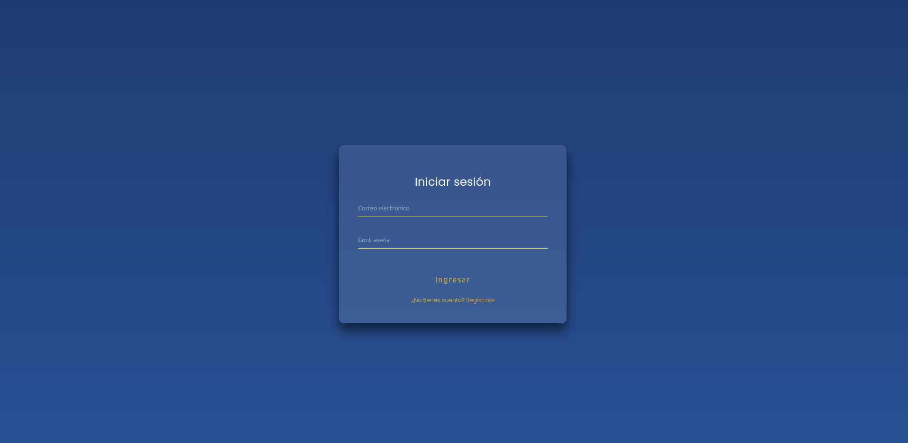
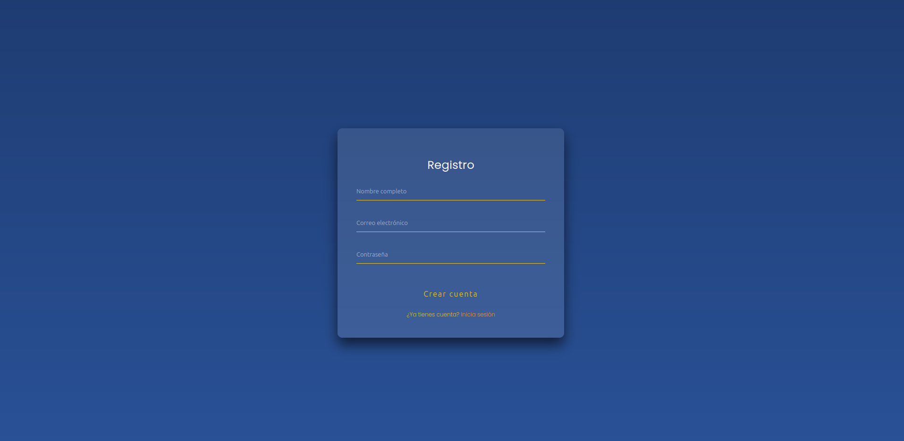

# Equipo: Error capa 8

## Integrantes

- Sandoval Garibay Salvador 
- Redondo González Omar 
- Hernández Gutiérrez Gerardo
- Ayala Chacón David 


## Índice
1. [Propósito del sistema](#propósito del sistema)
2. [Levantar Dockerfile y Docker-compose](#levantar-dockerfile-y-docker-compose)
3. [Usuario](#usuario)
4. [URL](#url)
5. [Ejecución](#ejecución)
6. [Pruebas](#pruebas)


# Propósito del sistema 

# Levantar Dockerfile y Docker-compose
Primero necesitamos clonar el proyecto mediante el cmd ```git clone url_repo ```,para poder levantar los contenedores  primero debes de posicionarte en el nivel en donde se encuentran los archivos que es ```/TareasIngSoftware/Tarea3/Tarea3 ``` , una manera de guiarse es si ves las carpetas ```src y target``` estas en la posición correcta.

Primero levantas el dockerfile utilizando ```docker build -t tarea3 .```seguido despues el docker compose solo es  ```docker compose up``` EN CASO DE TENER LOS PUERTOS 8080 Y 3306 OCUPADOS FAVOR DE LIBERARLOS 
# Usuario
Por predeterminado viene un usuario como admin el cual su correo es ```ssandovalgaribay@gmail.com``` y su contraseña: ```Salvador@123```
# URL
la url para este caso es http://localhost:8080/inicio/login# y su prueba para los endpoints es http://localhost:8080/q/swagger-ui/#/ 
# Ejecución 
De primera entrada cuando entremos a la url lo primero que veremos sera un login en donde tenemos dos opciones iniciar sesión o registrar una persona, en cierta forma en el registro se debe de poner la contraseña con mayusculas, minusculas y un caracter especial.





# Guia técnica básica


# Pruebas
Como tal para esta ocasión evitarnos el uso de postman o aplicar curl's se uso swagger-ui el cual mediante los ``@restcontrollers`` nos puede dar una visualizacion a cada uno.


En este apartado en especifico como se utilizo JWT y roles se deben autorizar por lo que cuando iniciamos sesión se adjunta el token con la informacion del usuario o administrador, en este caso en el swagger al ingresar un nuevo usuario o iniciar sesion solo es copiar el token y ponerlo ahi, OJO algunas funciones estan activas dependiendo las operaciones que pueden ejecutar, en caso de que no solo manda un error 403 el cual no estamos autorizados.


En otras si se puede como la visualización de los perfiles de cada quien


Al ser administrador se nos habilitan los demas metodos que podemos interactuar con ellos


